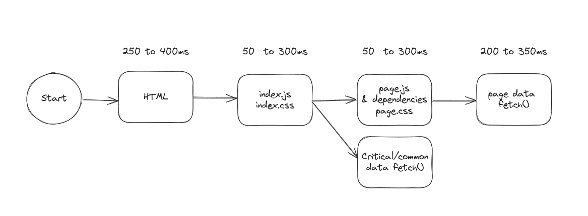
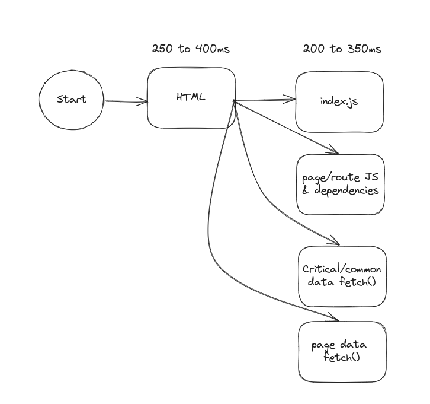

# preact-spa-template

Preact single-page app starter template. This template is tuned for "SPA" sites; sites that do not need server side rendering (SSR). If you need SSR, then take a look at [preact-mpa-template](https://github.com/Munawwar/preact-mpa-template).

Clone repo, use node.js 14+ and run following:

```
npm ci
npm run dev

# If you want an HTTP/2 local server
HTTP2=1 npm run dev
# when you run this the first time, `@expo/devcert` could ask root permissions to generate a certificate for local development server.
```

## Features!

- [Preact](https://github.com/preactjs/preact) + Preact hooks = 4 KB
- [Vite](https://vitejs.dev) and all the goodies that comes with it
- [preact-iso](https://github.com/preactjs/preact-iso)
  - Code split by pages + lazy loaded
  - Manages browser history
  - Manage page title - so that it looks good on browser tab & browser back button history
  - 404 Screen
  - Error Screen
- Preloading of JS and CSS (and with some effort fetch() calls too) with a server (JS, Go, Python, Ruby and PHP examples)
- [CSS Modules](https://github.com/css-modules/css-modules) - with eslint typo/unused css check and autocomplete (it is easy to remove this and use tailwind)
- ESLint and Prettier
- Type check via JSDocs and typescript checker (tsc)
- [Yorkie](https://www.npmjs.com/package/yorkie) git push linting hook
- [Vitest](https://vitest.dev/) + [Preact testing library](https://preactjs.com/guide/v10/preact-testing-library/) + [Playwright](https://playwright.dev/)

## Server? Why not serve directly from S3?

You can upload your index.html to any static file hosting service (like AWS S3) and it will work fine, but I find adding a server (doesn't matter which backend language you use) a good idea for multiple reasons:

### 1. Faster first page load

How loading of a typical SPA works: HTML loads, then index.js loads, then route.js loads, then route's dependencies loads. These are happening in serial order. However if you have a server, then you can preload all the dependencies in parallel (including CSS). Currently in addition to a JS example (`server.js`) that does preloading, I have examples with Python, Go, PHP and Ruby in `backend-examples/` directory.

<div style="text-align: center">

Without preloading
<br>

<br><br>

With preloading<br>


</div>

### 2. Avoiding CORS latency

If you put your index.html file on a static hosting service (like AWS S3), then where will your APIs be served from? On another sub-domain? In that case, every POST request will causes a CORS preflight request (for me it adds 150ms), which slows down calls unnecessarily. Even with Access-Control-Max-Age header, for every new URL path app needs to fetch, there will be one new preflight request. Say you have an ID in your URL (e.g. `/orders/:orderId`), then every unique ID will cause a new CORS request even with Access-Control-Max-Age header. You can avoid CORS preflight requests altogether by having APIs on the same domain as the HTML.

You might be thinking, "ok so where will JS,CSS,images be served from?". It can be served from the same server under same domain. Or you could upload JS/CSS/images to a static hosting service. "Aha! But you just re-introduced CORS!". Nope. `<link>` and `<script>` tags can easily accommodate JS & CSS from a subdomain. You probably will use a static file server + CDN anyway if your backend server doesn't support HTTP/2 (I recommend HTTP/2 or above for static files; it reduces waterfall requests as most browsers limit number of parallel HTTP/1 requests to `6` parallel requests).

Also by having APIs on the same domain, you can avoid other issues like cross domain cookie issues.

## About Routes

You can find routes mapping (it maps URL patterns to components) at [`src/routes/routes.js`](https://github.com/Munawwar/preact-spa-template/blob/preload/src/routes/routes.js).

You will notice that <code>lazy(() =&gt; import('./file'))</code> is
used for lazy loading and bundling each page's JS into separate bundles
for production.

You can also manage page titles from routes.js. `title` must be a string (it can have placeholders from route pattern. e.g. `Orders | :orderId`) or a function that which receives route info and returns a string.

Route components receives following properties about current route:

- url: `url` without origin and URI fragment. e.g `/user/123?tab=subscription`
- path: route pattern. e.g. `/user/:id`
- params: path matches (as an object). e.g: `{ id: 'user1' }`
- title: the title text used to set head title tag
- query: query params (as an object). e.g: `{ search: 'john' }`
- routeId: the routeId used in route.js

Path redirects can be configured in `src/routes/redirects.js`

## Path aliases

`~` is short hand for src/ directory. So you don't have to do `import '../../../js-file-in-src-directory'`. You can just do `import '~/js-file-in-src-directory'`

Similarly for types, there is a shorthand alias `@` to the types/ directory. e.g. `import('@/Route').PageComponent`

## Preloading fetch() calls

Check example at [`src/routes/routes.js`](https://github.com/Munawwar/preact-spa-template/blob/preload/src/routes/routes.js).

## Where to go next?

- Check package.json - dependencies, scripts and eslint rules
- Check the implementation of [`src/App.jsx`](https://github.com/Munawwar/preact-spa-template/blob/preload/src/App.jsx).
- Read about [preact/compat](https://preactjs.com/guide/v10/switching-to-preact/)
- Add or remove stuff as you need. Check out other tools:
  - Whole list of preact related tools at [awesome-preact](https://github.com/preactjs/awesome-preact)
  - Icons
    - [Material Icons](https://github.com/material-icons/material-icons)
    - Remove SVG from JS with [preact-svg-icon](https://www.npmjs.com/package/preact-svg-icon)
  - CSS Libraries
    - [Open Props](https://open-props.style)
    - [Tailwind](https://tailwindcss.com)
    - [Fluid](https://fluid.tw/)
  - UI Libraries
    - [Material UI](https://github.com/mui/material-ui/tree/master/examples/material-preact)
    - [Preact Fluid](https://github.com/ajainvivek/preact-fluid)
  - State managers
    - [Preact Signals](https://preactjs.com/guide/v10/signals/)
    - [Tanstack Query with Preact Signals](https://www.npmjs.com/package/@preact-signals/query)
    - [nanostore](https://github.com/nanostores/nanostores)
    - [query with nanostore](https://github.com/nanostores/query)
